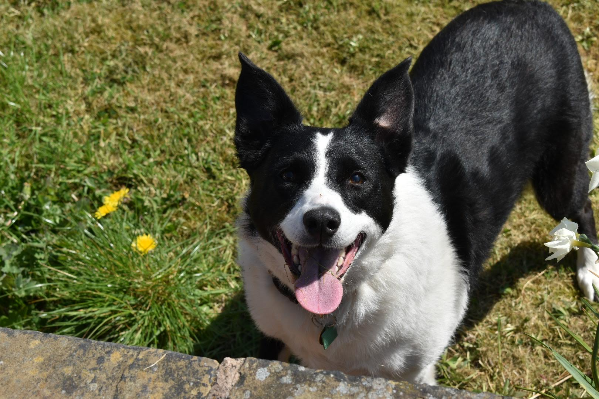

# Ideation Report

**Word count** 300 words maximum

Describe and illustrate your ideation process. Describe the techniques use and report on the output/results.

Has it helped you define you project? Explore a variety of ideas in a short time? Get ann agreement on the topic of your guide? Investigate possibilities?

Put your media in the `sp1-media` folder.

Embed the images in the markdown file using either of these methods.

To begin planning our website, we initially used a brainstorming approach. This approach meant that we gathered a large range of ideas that would fit the scope of the assignment. This also meant that everyone put forward their ideas without any criticism.

Once we had a collection of ideas, we created a table containing the requirements of the website, and went through each website idea, comparing it to the requirements and analysing whether it would work well/fit the requirements.
By doing this process, we could analyse which ideas worked best with the scope and organised them into a list of most viable to least viable.
We then began a process of elimination, getting rid of any ideas we didn’t deem fit/appropriate for the project.

Once we had completed this process, we were left with 3 ideas, Dog charity, Car wash site, or a fitness/gym guide. We discussed in a Round Robin the Positives and Negatives of each idea, and then came to a decision as a group.

We decided to go for the Dog Charity as it suited the scope/requirements the most, and all members have knowledge/experience on the subject.

The website design will cover multiple aspects of the Dog Charity, including an adoption section, donation section, products/services section, and a general guide/advice section.




```

```


```

```
