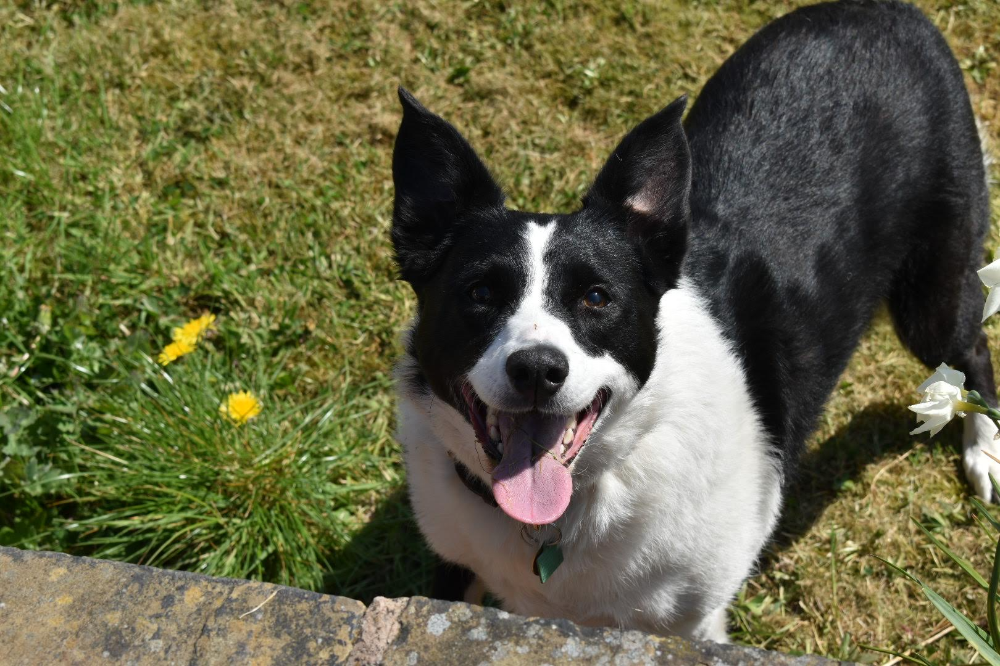
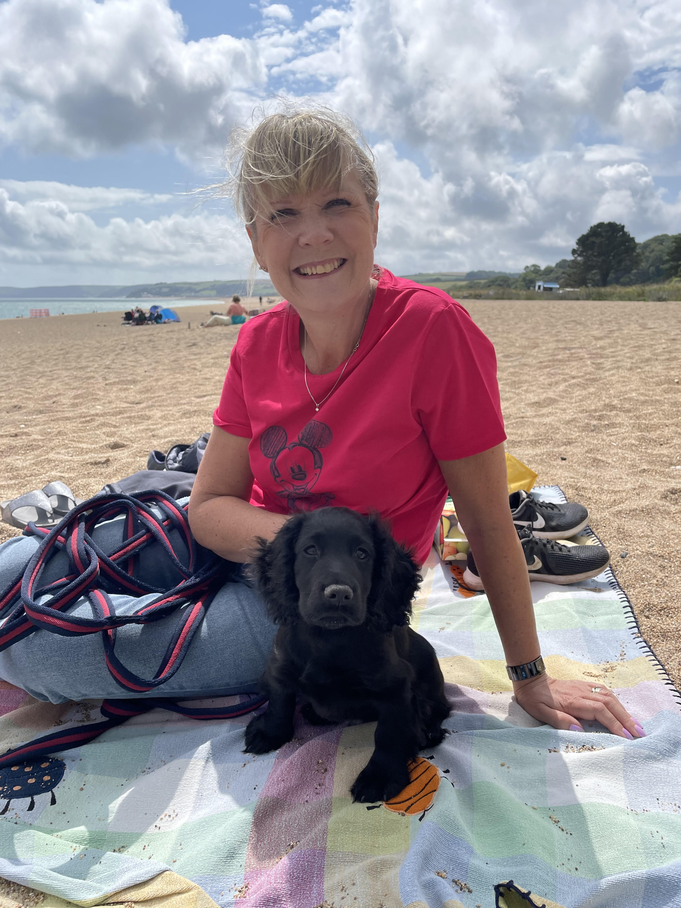

# Personas

Add your three personas.

*Tutors will download the image to view the full size persona*.

<!-- edit as required -->

## Persona One

### Name of persona
Elderley relative- loves dogs and wants them to be the best they can. Struggles with dementia so having a written guide means she won't forgot the basics of looking after a dog. Also she'd share it around with her family so the audience of the webiste should hopefully increase in location on on device type. Links well with the client research as this area has been discussed to try and accomodate as many users as possible.

---

## Persona Two

### Name of persona
Provide a description and explain how this persona was derived from your user research.

---

## Persona Three

### Name of persona
Provide a description and explain how this persona was derived from your user research.
